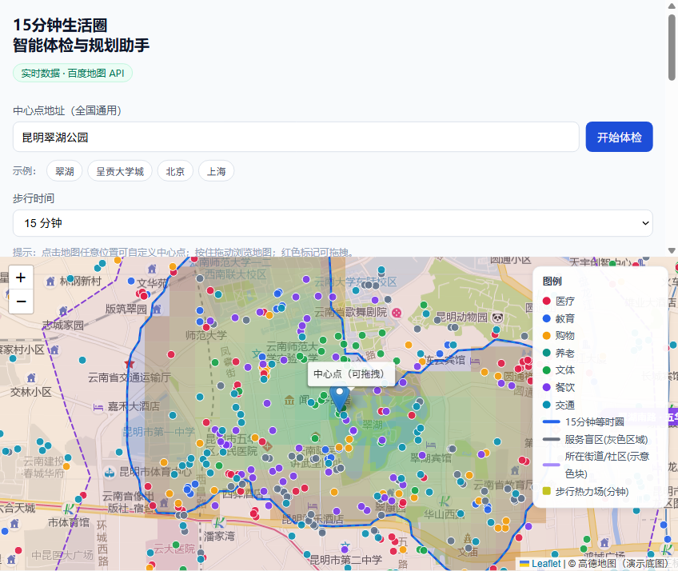
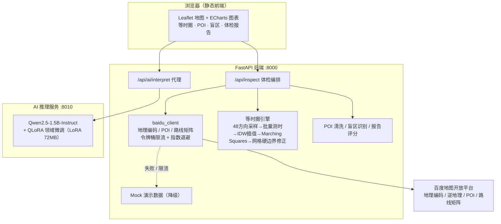

# 15分钟生活圈 · 智能体检与规划助手

基于百度地图开放能力（地理编码、POI 检索、步行算路、批量算路）的「15分钟生活圈」体检 Web 应用：
输入任意城市/社区的中心点坐标或地址，系统自动计算**基于真实路网的 15 分钟步行等时圈**，
统计圈内各类民生设施覆盖情况，识别 1km 内缺菜市场/药店/小学的**服务盲区（灰色区域）**，
并输出可视化「体检报告」。

> 开源 AI 工具赛道 · 百度地图 15 分钟生活圈赛题实现。
> 内置**自训 AI 能力**：基于魔塔开源模型 Qwen2.5-1.5B-Instruct 做了 QLoRA 领域微调
> （54 条"体检数据→解读+选址建议"样本，本机 8GB 显存训练约 3 分钟），
> 点击体检结果区的「✨ AI 解读与选址建议」即可生成自然语言解读（训练复现见 `docs/模型训练教程.md`）。

## 功能特性（对照评分维度）

| 维度 | 实现 |
|---|---|
| 功能正确性与覆盖率 | 地理编码/逆地理编码、POI 检索、步行算路、批量算路调用稳定；地图渲染等时圈热力图；识别 1km 服务盲区；公交/地铁站点检索 |
| API 深度与工程优化 | 路线矩阵批量测时（分块并发 + 令牌桶限流）；API 异常指数退避重试；POI 缺失/QPS 限流自动降级到演示数据；IDW 空间插值 + Marching Squares 等值线 |
| 产品交互与体验 | 热力图、雷达图、柱状图、等时圈多边形、灰色区域标注；点击地图/输入地址自定义中心点；全国任意地点可用；**AI 解读与选址建议** |
| 开源工程规范 | 模块化 FastAPI + 前端静态页；README 详尽；AK 走 `.env` 脱敏；Docker 一键部署；pytest 34 项测试；**AI 训练脚本/数据集开源**；MIT 许可 |

## 与官方参考案例的对照

官方「门店选址」示例（lbs.baidu.com/jsapi/demo/usecases/industry/locationselection.html）只能做到：
**给定中心点与半径 → 画直线距离圆 → 分类检索圆内设施 → 按直线距离排序**。
本题在其之上实现了官方要求的三层进阶，本仓库均已完成：

| 进阶 | 官方示例 | 本系统 |
|---|---|---|
| ① 范围 | 直线半径圆 | **真实路网的步行等时圈**（扇形采样 + 批量算路 + 空间插值） |
| ② 结论 | 设施清单（按距离排序） | **覆盖率量化 + 服务盲区判定**（等时圈内统计 + 1km 网格盲区识别） |
| ③ 呈现 | 单点查看 | **可视化体检报告**（评分 + 雷达/柱状图 + 地图渲染，可交互自定义中心点） |

## 效果演示（实时模式 · 百度 API 真实数据）



昆明市五华区翠湖公园（`25.0406, 102.7146`，15 分钟步行）：

- 综合评分 **80/100**（医疗/餐饮/交通覆盖良好，购物/文体偏少扣分，圈内无养老设施为主要缺口）
- 等时圈面积 **1.35~1.99 km²**，最远可达 **929.5~1185 m**（48 方向采样 + 网格硬边界修正 + 单点复核）
- 圈内六类民生设施：医疗 67 · 餐饮 49 · 交通 32 · 购物 17 · 教育 11 · 文体 5（全量 POI 817 个）
- 自动识别 **1 处服务盲区**（灰色区域），并按"必备设施缺失"规则给出扣分与建议
- 真实路网方向性复核：边界点直线距离极差 **752 m**（非圆形），逐方向真实耗时见 [实测对比报告](docs/实测对比报告.md)

## 快速开始

### 环境要求

- Python 3.10+（本地运行）或 Docker（容器运行）
- 浏览器访问 http://127.0.0.1:8000

### 方式一：本地运行（无需 Docker）

**Windows**：双击 `scripts\start.bat`（首次自动创建虚拟环境并安装依赖）。

**Linux / macOS**：

```bash
./scripts/start.sh
```

首次运行自动完成 `python3 -m venv` 与依赖安装，之后直接启动服务。

### 方式二：Docker 运行

```bash
docker compose up --build
```

### 获取百度地图 AK（实时数据）

1. 打开 https://lbsyun.baidu.com ，用百度账号登录（无账号先注册）。
2. 控制台 → 应用管理 → 我的应用 → **创建应用**。
3. 应用类型选「**服务端**」，创建后复制「访问应用 AK」。
4. 复制 `.env.example` 为 `.env`，填入 `BAIDU_AK_SERVER=<你的AK>`，重启服务即自动切换为实时数据。

> 未配置 AK 时自动进入**演示模式（Mock）**，全流程可跑通，便于评审演示与开发调试。

### 启动 AI 解读服务（可选，自训模型）

```powershell
# 已训练好的微调模型权重见本机 ai\models\qwen15min-lora（gitignore，不入库）
ai\.venv\Scripts\python -u ai\server.py        # 独立 AI 服务 :8010
```

启动后体检结果区会出现「✨ AI 解读与选址建议」按钮；AI 服务未启动时按钮自动提示不可用，**不影响主流程**。
模型训练与复现步骤见 [`docs/模型训练教程.md`](docs/模型训练教程.md)。

## 配置说明

| 变量 | 说明 | 默认 |
|---|---|---|
| `BAIDU_AK_SERVER` | 服务端 AK（地理编码/POI/算路） | 空（演示模式） |
| `BAIDU_AK_BROWSER` | 浏览器端 AK（百度 JS 渲染，可选） | 空 |
| `FORCE_MOCK` | 强制演示模式 | 空（自动） |
| `BAIDU_QPS` | 百度接口 QPS 限制 | 10 |
| `WALK_MINUTES` | 步行体检时间（分钟） | 15 |
| `SAMPLE_DIRECTIONS` | 扇区采样方向数 | 48 |
| `SAMPLE_STEP_M` | 采样步长（米） | 100 |
| `MAX_RADIUS_M` | 最大采样半径（米） | 2000 |
| `GRID_N` | IDW 插值网格分辨率 | 60 |
| `POI_RADIUS_M` / `BLIND_RADIUS_M` / `BLIND_CELL_M` | POI 检索半径 / 盲区缓冲半径 / 网格边长（米） | 2500 / 1000 / 200 |

## 系统架构



- **真实数据链路**：浏览器 → FastAPI → 百度开放平台（测时/POI/编码），全程令牌桶限流 + 指数退避，配额不足自动降级 Mock 并明示警告。
- **AI 链路**：体检结果通过 `/api/ai/interpret` 代理到本地推理服务，生成自然语言解读与选址建议（详情见下节）。

## 自训 AI：Qwen2.5-1.5B + QLoRA 领域微调

本项目自带**本地微调的开源大模型**，对体检结果做自然语言解读与设施选址建议，不依赖任何外部 AI API。

| 环节 | 实现 |
|---|---|
| 基座模型 | 魔塔开源 `Qwen2.5-1.5B-Instruct`（3.09GB） |
| 训练方式 | 自写 QLoRA 微调脚本（`ai/train.py`），4-bit 量化 + LoRA 适配器 |
| 训练数据 | `ai/data_gen.py` 用本项目引擎真实跑 60 个中心点生成 54 条"体检数据→解读+选址建议"样本（train 54 / dev 6） |
| 训练成本 | 本机 RTX 5060 8GB 显存，约 3 分钟完成一轮微调 |
| 产物 | LoRA 权重仅 **72MB**（`ai/models/qwen15min-lora`，gitignore 不入库） |
| 推理服务 | `ai/server.py` 独立服务 :8010，首次调用懒加载约 20s，之后流式生成 |
| 前端入口 | 体检结果区「✨ AI 解读与选址建议」按钮，AI 未启动时自动提示不可用、不影响主流程 |

**输出示例**（自训模型真实格式，内容随体检结果变化）：

```
【体检解读】该中心点 15 分钟步行圈覆盖良好，综合评分 80 分。
医疗（67 处）与餐饮（49 处）配置完善，购物（17 处）与文体（5 处）相对偏弱。
【风险提示】养老设施为该圈最薄弱项（0 分），区域内缺少养老服务资源。
【选址建议】若需补充生活服务，建议优先在东北方向布设菜市场/便利店，
以覆盖当前 1km 内的服务盲区（灰色区域）。
```

训练全程保姆级复现教程见 [`docs/模型训练教程.md`](docs/模型训练教程.md)（含环境搭建、数据生成、微调、部署四步）。

## API 文档

### `GET /api/health`

服务健康检查，返回 `mode: mock | live`。

### `GET /api/config`

返回当前运行模式、步行分钟数、检索分类等配置。

### `POST /api/inspect`（核心体检接口）

请求体（二选一提供中心点）：

```json
{ "address": "昆明市五华区翠湖公园", "walk_minutes": 15 }
{ "center": { "lat": 25.0406, "lng": 102.7146 }, "walk_minutes": 15 }
```

响应要点：

```json
{
  "center": { "lat": 25.0406, "lng": 102.7146, "address": "..." },
  "mode": "mock",
  "warnings": [],
  "isochrone": {
    "polygon": [[lng, lat], ...],
    "boundary_polygon": [[lng, lat], ...],
    "grid": { "n": 60, "half_size_m": 2000, "max_minutes": 40.5, "values": [...] },
    "stats": { "max_reach_m": 929.5, "area_km2": 1.7309, "boundary_points": 48, "walk_minutes": 15 }
  },
  "pois": [{ "name": "...", "lng": ..., "lat": ..., "category": "医疗", "search_key": "药店" }],
  "coverage": { "counts": {...}, "scores": {...}, "overall": 80, "blind_penalty": 20, "blind_summary": "..." },
  "blind_spots": { "required": [...], "polygons": [...], "cluster_count": 1, "summary": "..." },
  "elapsed_ms": 28000
}
```

## 等时圈算法（核心，5 步）

1. **扇区采样**：以中心点为圆心分 48 个方向（每 7.5°），每个方向沿直线每 100m 布采样点至 2km（共 960 点）；
2. **批量测时**：用百度路线矩阵（`routematrix/v2/walking`）分块一次性测出采样点步行耗时（分块 ≤90 组合 + 独立慢速令牌桶，规避并发配额限制）；
3. **边界提取**：每个方向取「步行 ≤ 阈值」的最远点，并在相邻测点间线性插值细化；
4. **IDW 空间插值**：对中心周边 60×60 网格节点，用邻近测时点做反距离加权插值，得到「分钟场」（同时作为热力图数据）；
5. **Marching Squares**：从分钟场提取阈值等值线，得到平滑等时圈多边形。
6. **网格硬边界修正**：任何插值格点若超出所在采样方向的真实可达边界，强制标记为不可达，消除跨河/跨湖的"插值凸出"假覆盖。
7. **单点复核（方案 B）**：对均匀角度抽样方向，用轻量单点算路（`directionlite/v1/walking`，独立限流桶）复核真实耗时——超阈值向内二分内缩、明显不足向外探测外扩；复核失败自动保持原边界（安全降级），复核后重建网格剖面同步修正渲染与统计。批量算路口径与单点口径存在方向性偏差（±25% 量级），本步骤逐方向校准。

不获取底层路网数据，仅用分散点位 API 测时结果推导近似连通区域——命中评审的「创新空间插值」加分项。
详细设计见 [docs/技术设计文档.md](docs/技术设计文档.md)。

## 目录结构

```
.
├── backend/
│   ├── app/
│   │   ├── main.py            # FastAPI 入口与体检编排
│   │   ├── config.py          # 环境变量配置
│   │   ├── api/               # 百度客户端 / 限流重试 / 演示数据
│   │   │   ├── baidu_client.py
│   │   │   ├── rate_limiter.py
│   │   │   └── mock.py
│   │   └── core/              # 等时圈 / POI清洗 / 盲区识别 / 报告
│   │       ├── isochrone.py
│   │       ├── poi_cleaner.py
│   │       ├── blind_spot.py
│   │       └── report.py
│   ├── tests/                 # pytest 单元测试（34 项）
│   ├── requirements.txt
│   └── run.py
├── frontend/                  # 静态前端（Leaflet + ECharts，由 FastAPI 托管）
│   ├── index.html
│   ├── css/style.css
│   └── js/app.js
├── scripts/                   # 一键启动脚本（bat/sh）与 Docker 脚本
├── ai/                        # 自训 AI：训练脚本 / 数据集 / 推理服务（权重 gitignore）
│   ├── data_gen.py            # 造数据：项目引擎跑 60 个中心点 → 结构化体检 + 解读文本
│   ├── data/                  # train.json / dev.json / dataset_info.json（开源）
│   ├── train.py               # QLoRA 微调 Qwen2.5-1.5B（依赖见教程）
│   └── server.py              # 独立推理服务 :8010，主后端 /api/ai/interpret 代理
├── docs/                      # 技术设计文档 / 实测对比报告 / 模型训练教程 / 截图
├── Dockerfile
├── docker-compose.yml
├── .env.example               # 环境变量样例（AK 脱敏）
└── LICENSE                    # MIT 开源许可
```

## 测试

```bash
cd backend
.venv\Scripts\python -m pytest -q    # Windows
.venv/bin/python -m pytest -q        # Linux/macOS
```

覆盖：坐标转换、等时圈算法（含网格硬边界修正回归）、单点复核（方案B）、POI 清洗、盲区识别、限流重试、百度客户端解析、API 端点（34 项全部通过）。

## 开源许可

[MIT License](LICENSE)
